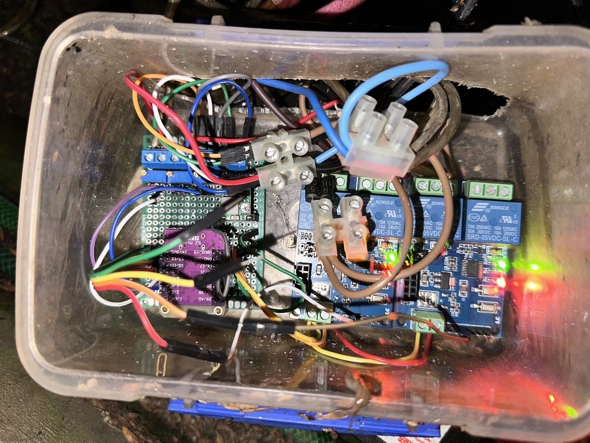
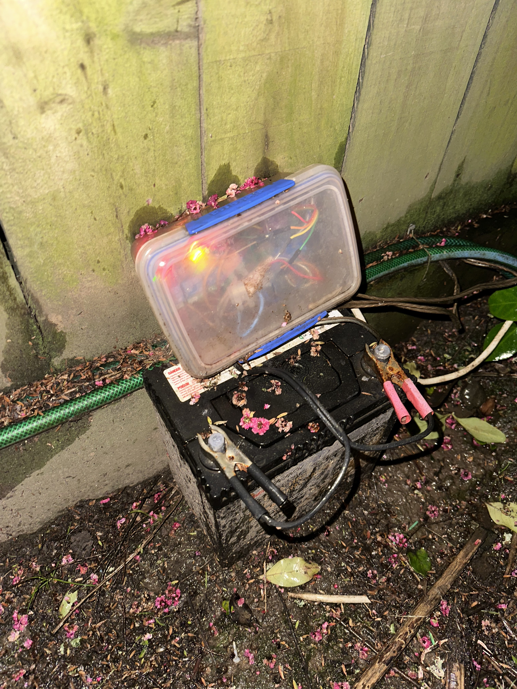

# ESPHome Basic Solar Powered Mud Kitchen

Uses relays to switch on power to and a play house lights.

Relays are LC Tech UART controlled from AliExpress. They are designed to use an ESP-01, but I have wired up two to use dedicated UART channels from an ESP32-S2.

## Relays:
 1. Pump used to move water from a lower catch tack to an upper tank for gravity feeding.
 2. Main power for lights and pump.
 3. Charge enable used to connect the charge source to the battery when there sufficient power. Also used to disconnect the charge source when battery is overcharging.
 
## ADCs
  1. Used to sense charge source.
  2. Used to sense battery state.
  3. Used as a binary sensor to sense reed switch state.

Two reed switches in series sense when the tanks are in a state that we can pump from the lower to the upper tank.
Pulldown ensures there is adequate difference between on and off states.

## Data Graph
Showing one sunny, and one cloudy day.

## Internalls of Prototype.

Have has no issues so far, I expect insect infestation to cause failure since the bottom of the enclosure is open.

I was expecting more water ingress, but has survived 1 in 100 year rain.

## Installed Prototype.

This has been running very well since I have installed it here.

I had been expecting more failure modes since it's so open and un-protected.

I was expecting water ingress / moisture to be an issue, but so far it has not been an issue. I am sure that being exposed to the elements has deteriorated it somewhat.
However it has some heat and keeps relatively dry.

I think ill leave it like this until it fails and fix as needed.

